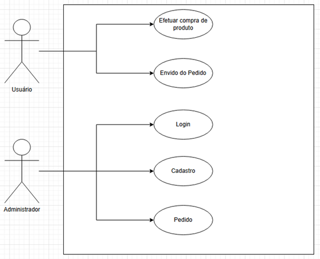
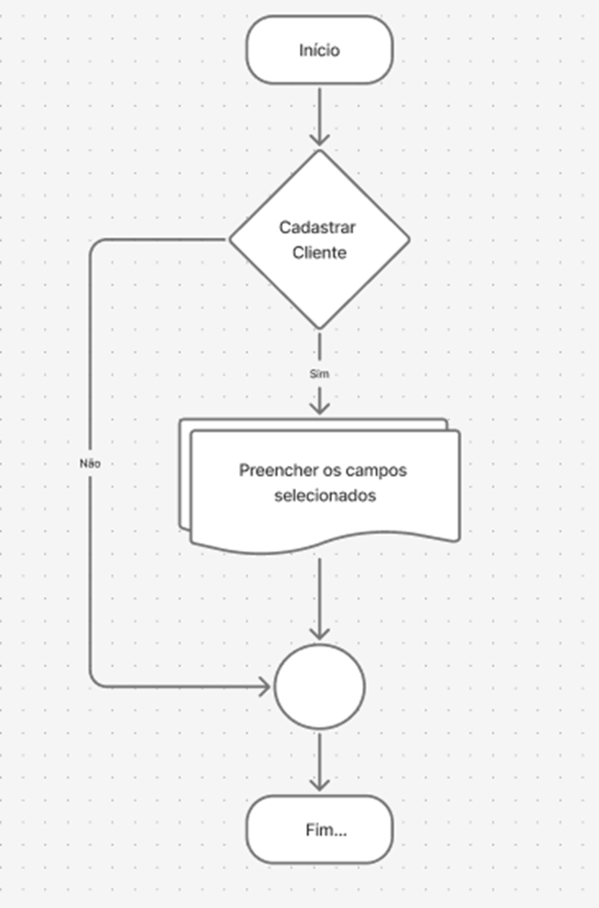
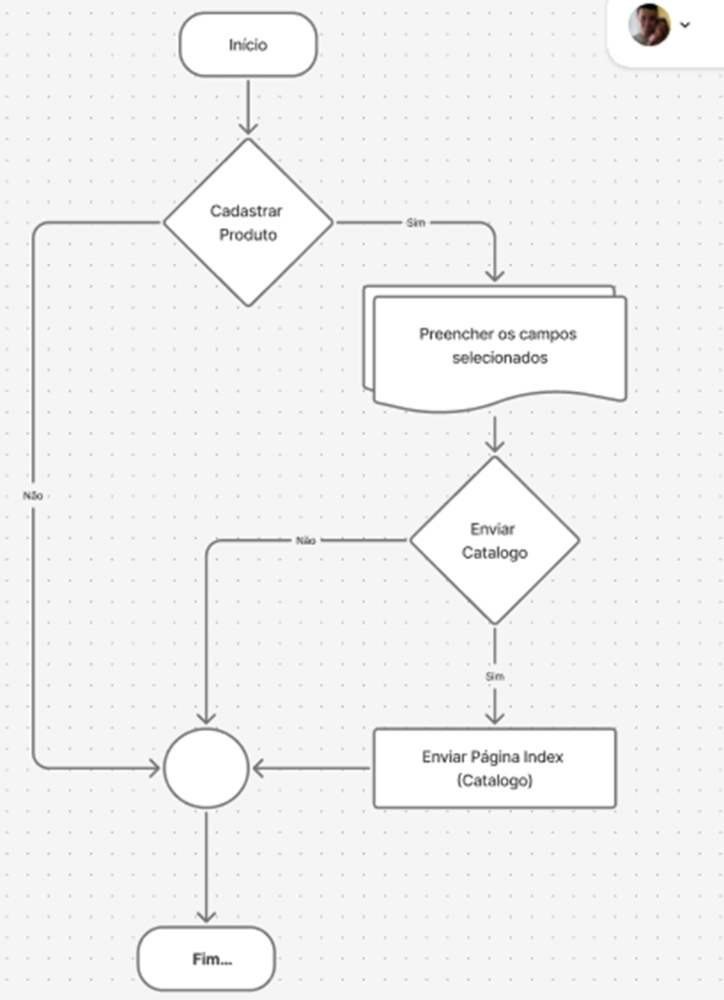
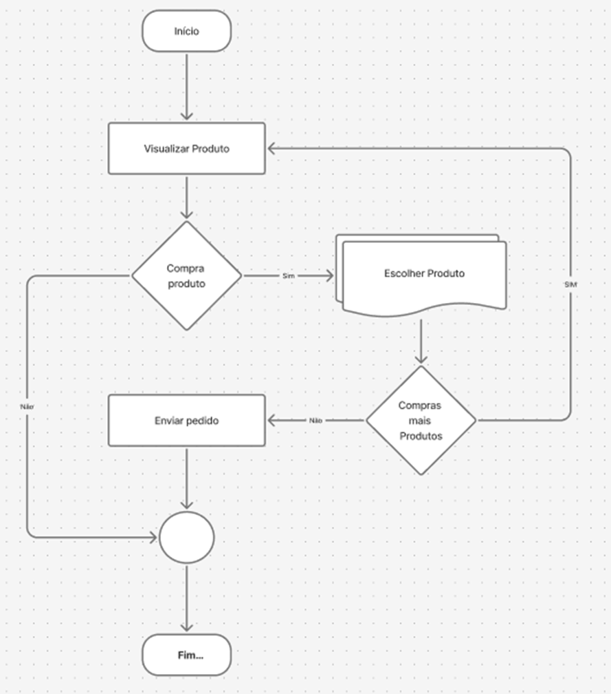
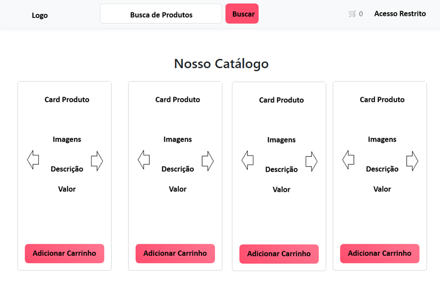
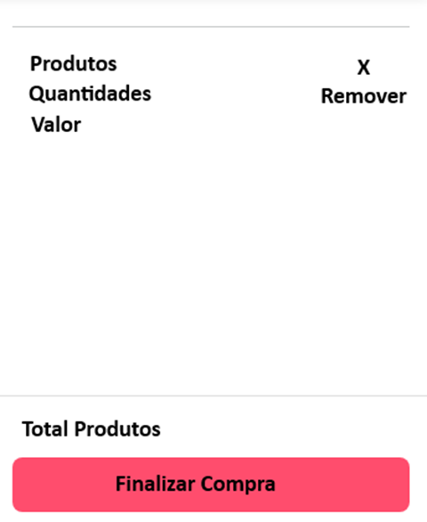
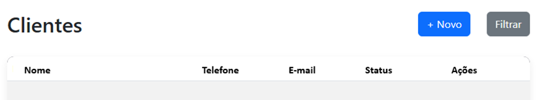
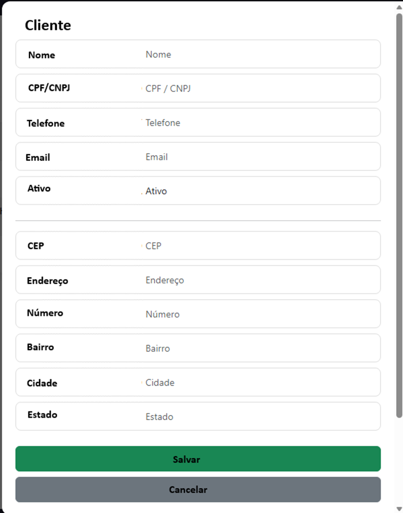
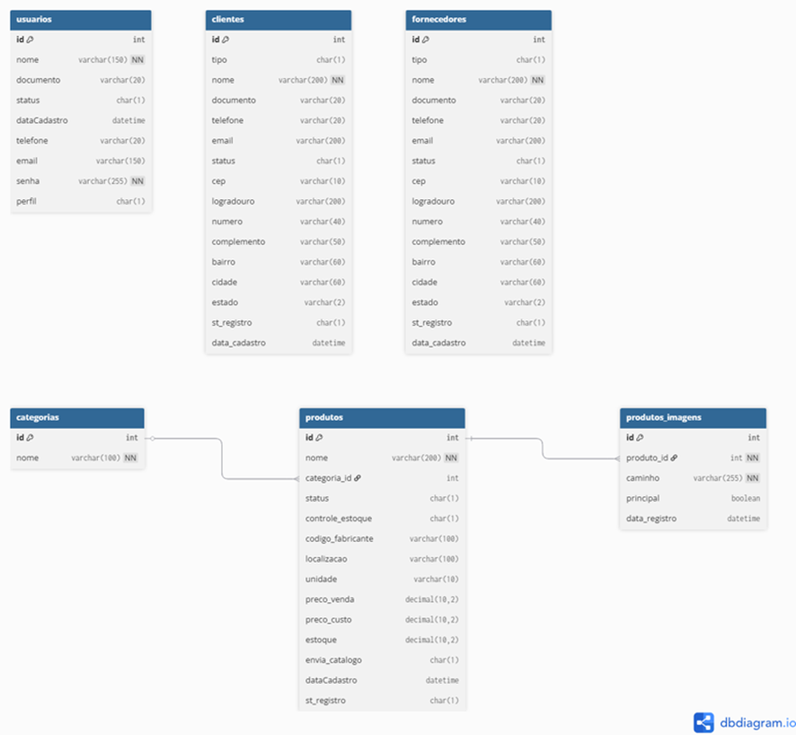

# Projeto Integrador

> Sistema ERP web para gestão comercial com cadastro de usuários, clientes, fornecedores, produtos, categorias, vendas, compras e controle de estoque.

## Descrição detalhada

O Projeto Integrador é uma solução de gestão empresarial para lojas que precisam organizar processos de vendas, compras e estoque em uma única plataforma. O sistema oferece:

- cadastro e gerenciamento de usuários
- controle de clientes, fornecedores e categorias
- cadastro, edição e listagem de produtos
- catálogo público com carrinho de compras
- geração de pedidos de venda a partir do catálogo
- controle de movimentações de estoque
- dashboard de administração

A arquitetura do projeto separa o back-end, implementado em Node.js e Express, do front-end, baseado em HTML, CSS e JavaScript com consumo de API via `fetch`. O banco de dados é MySQL e a autenticação é tratada com sessões e criptografia de senha.

## Tecnologias utilizadas

- Node.js
- Express
- MySQL
- JavaScript
- HTML
- CSS
- Bootstrap
- Multer
- bcrypt
- express-session
- dotenv
- cors

## UML — Diagrama de caso de uso

O sistema ERP envolve dois atores principais:

- Administrador
- Cliente (Catálogo)

Os casos de uso principais incluem:

- Cadastro e gestão de usuários
- Cadastro de clientes, fornecedores, categorias e produtos
- Acesso ao catálogo público
- Inclusão de produtos no carrinho
- Geração de pedidos de venda



> Substitua a imagem acima pelo diagrama real do projeto.

## Fluxogramas

### 1. Cadastro de Cliente

Fluxo principal de cadastro de cliente, desde o formulário de dados até a gravação em banco de dados.



> Substitua a imagem acima pelo fluxograma real do cadastro de cliente.

### 2. Cadastro de Produto

Fluxo de cadastro de produto, com validação de campos, upload de imagem e persistência do registro.



> Substitua a imagem acima pelo fluxograma real do cadastro de produto.

### 3. Compra no Catálogo

Fluxo de compra no catálogo público, passando pela seleção de produto, carrinho e fechamento de pedido.



> Substitua a imagem acima pelo fluxograma real da compra no catálogo.

## Wireframe — Estrutura das telas

A seguir, estão as telas principais previstas no sistema.

### Tela inicial do sistema



### Carrinho de compras



### Cadastro de Cliente



### Novo Cliente



> Substitua as imagens acima pelos wireframes reais, se disponíveis.

## DER — Diagrama Entidade Relacionamento

O DER descreve os relacionamentos entre usuários, clientes, fornecedores, produtos, categorias, pedidos e itens de venda.



> Substitua a imagem acima pelo DER real do projeto.

## Aplicação de Back-End

A aplicação de back-end é responsável pela lógica do sistema, processamento das requisições e comunicação com o banco de dados. Nessa camada são realizadas validações, regras de negócio e operações de cadastro, consulta, atualização e exclusão de dados, garantindo a integridade e segurança das informações.

Tecnologias:

- Node.js
- Express
- MySQL

Estrutura:

- `/controller`
- `/js`
- `/routes`
- `/pages`
- `/app.js`

Funcionalidades:

- API REST
- CRUD completo
- Autenticação
- Filtros

## Aplicação Front-end

A aplicação de front-end corresponde à interface do sistema, permitindo a interação do usuário com as funcionalidades disponíveis. É responsável pela visualização dos dados e envio de requisições ao back-end, proporcionando uma navegação simples e eficiente.

Tecnologias:

- HTML
- CSS
- Bootstrap
- JavaScript (fetch API)

Funcionalidades:

- Consumo da API via fetch
- Modais para cadastro
- Tabelas dinâmicas
- Filtros
- Carrinho de compras
- Login

## Funcionalidades principais

- API REST com CRUD completo
- autenticação de usuário
- filtros e tabelas dinâmicas
- modais de cadastro
- catálogo público com carrinho de compras
- conversão de pedido do catálogo em pedido de venda
- controle de saída de estoque

## Estrutura de pastas

```text
ProjetoIntegrador/
├── LICENSE
├── readme.md
├── package.json
├── package-lock.json
├── server.js
├── instalacaoNode.md
├── erp_loja.sql
├── Projeto Integrador.docx
├── Desenvolvimento Projeto Integrador..docx
├── sistema/
│   ├── app.js
│   ├── server.js
│   ├── vercel.json
│   ├── config/
│   │   ├── db.js
│   │   └── upload.js
│   ├── controller/
│   │   ├── auth.js
│   │   ├── catalogo.js
│   │   ├── categorias.js
│   │   ├── clientes.js
│   │   ├── fornecedores.js
│   │   ├── pedido.js
│   │   ├── produtos.js
│   │   ├── usuarios.js
│   │   └── vendas.js
│   ├── css/
│   ├── img/
│   ├── js/
│   ├── layout/
│   ├── middleware/
│   ├── pages/
│   ├── sql/
│   └── uploads/
└── uploads/
    └── produtos/
```

## Pré-requisitos

Antes de instalar e executar o projeto, verifique se o seu ambiente atende aos seguintes requisitos:

- Node.js instalado (versão 16 ou superior recomendada)
- npm instalado
- MySQL instalado e em execução
- Navegador web moderno
- Editor de texto ou IDE (por exemplo, Visual Studio Code)

## Instalação

1. Clone o repositório:

```bash
git clone https://github.com/Emerdcp/ProjetoIntegrador.git
```

2. Acesse a pasta do projeto:

```bash
cd ProjetoIntegrador
```

3. Instale as dependências:

```bash
npm install
```

4. Crie a base de dados MySQL e importe o esquema em `erp_loja.sql` ou os scripts da pasta `sistema/sql/`.

5. Configure variáveis de ambiente criando um arquivo `.env` na raiz do projeto. Exemplo:

```env
DB_HOST=localhost
DB_USER=seu_usuario
DB_PASSWORD=sua_senha
DB_NAME=nome_do_banco
PORT=3000
```

6. Ajuste a conexão com o banco de dados em `sistema/config/db.js`, caso necessário.

## Como executar o projeto

Siga estes passos para executar o sistema localmente:

1. Abra o terminal na raiz do projeto.
2. Verifique se o MySQL está em execução.
3. Instale as dependências se ainda não estiverem instaladas:

```bash
npm install
```

4. Inicie o servidor:

```bash
npm start
```

5. Abra o navegador e acesse:

```text
http://localhost:3000
```

> Durante o desenvolvimento, você também pode usar:
>
> ```bash
> npx nodemon server.js
> ```

## Scripts disponíveis

- `npm start`: inicia o servidor usando `node server.js`
- `npm test`: script padrão sem testes configurados

Exemplo:

```bash
npm start
```

## Exemplo de uso

Após iniciar o servidor:

1. Acesse `http://localhost:3000`
2. Faça login com um usuário cadastrado
3. Acesse o painel administrativo
4. Cadastre ou edite clientes, fornecedores, produtos e categorias
5. Abra o catálogo público e adicione produtos ao carrinho
6. Converta o carrinho em pedido de venda e acompanhe a saída de estoque

## Licença

Este projeto está licenciado sob a licença `ISC`.

## Links úteis

- Repositório GitHub: https://github.com/Emerdcp/ProjetoIntegrador/
- Demo do sistema: https://emerdcp.github.io/ProjetoIntegrador/sistema/pages/
